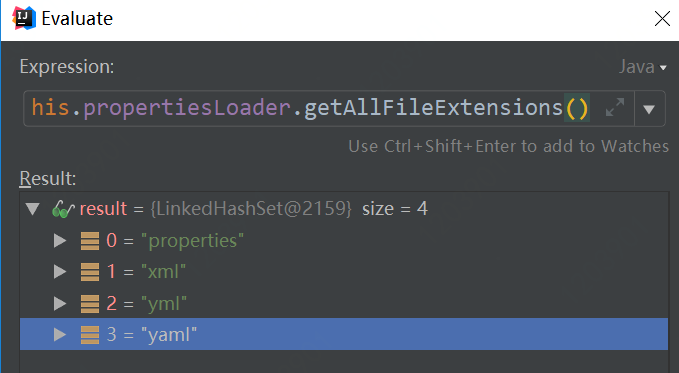

# Spring Boot加载application.properties或application.yaml文件的过程

## 源码解析过程
1. 首先，一切从SpringApplication.java的run方式开始，
```java
// 加载环境变量的入口
 ConfigurableEnvironment environment = prepareEnvironment(listeners, applicationArguments);
``` 
该行代码加载变量，包括系统变量、命令行变量、application.properties文件变量
prepareEnvironment方法源码如下：
```java
private ConfigurableEnvironment prepareEnvironment(
			SpringApplicationRunListeners listeners,
			ApplicationArguments applicationArguments) {
		// 创建环境变量对象
		ConfigurableEnvironment environment = getOrCreateEnvironment();
        // 加载系统变量、命令行变量
		configureEnvironment(environment, applicationArguments.getSourceArgs());
        // <关键点> 利用消息通知方式，加载application.properties/yaml文件变量
		listeners.environmentPrepared(environment);
		if (!this.webEnvironment) {
			environment = new EnvironmentConverter(getClassLoader())
					.convertToStandardEnvironmentIfNecessary(environment);
		}
		return environment;
	}
```

2. SpringApplicationRunListeners.java包括SpringApplicationRunListenter接口实现类集合。
其中EventPublishingRunListener实现了SpringApplicationRunListenter接口， 是启动Spring消息通知机制的核心类，里面有消息通知广播SimpleApplicationEventMulticaster，注册了所有SpringApplicationRunListenter

SpringApplicationRunListeners.java方法中
```java
public void environmentPrepared(ConfigurableEnvironment environment) {
		for (SpringApplicationRunListener listener : this.listeners) {
			listener.environmentPrepared(environment);
		}
	}
```
environmentPrepared方法向消息通知机制中发送“准备环境变量”的消息

3. EventPublishingRunListener.java方法中
```java
public void environmentPrepared(ConfigurableEnvironment environment) {
    this.initialMulticaster.multicastEvent(new ApplicationEnvironmentPreparedEvent(
            this.application, this.args, environment));
}
```
environmentPrepared向Spring广播ApplicationEnvironmentPreparedEvent消息事件对象。这时候需要有ConfigFileApplicationListener接收该消息事件对象。

4. ConfigFileApplicationListener.java 该类实现ApplicationListener接口，同时也实现EnvironmentPostProcessor
```java
@Override
public void onApplicationEvent(ApplicationEvent event) {
    //<关键点> 处理ApplicationEnvironmentPreparedEvent消息事件的方法
    if (event instanceof ApplicationEnvironmentPreparedEvent) {
        onApplicationEnvironmentPreparedEvent(
                (ApplicationEnvironmentPreparedEvent) event);
    }
    if (event instanceof ApplicationPreparedEvent) {
        onApplicationPreparedEvent(event);
    }
}
```

```java
private void onApplicationEnvironmentPreparedEvent(
			ApplicationEnvironmentPreparedEvent event) {
    List<EnvironmentPostProcessor> postProcessors = loadPostProcessors();
    postProcessors.add(this);
    AnnotationAwareOrderComparator.sort(postProcessors);
    for (EnvironmentPostProcessor postProcessor : postProcessors) {
        postProcessor.postProcessEnvironment(event.getEnvironment(),
                event.getSpringApplication());
    }
}
```

```java
@Override
	public void postProcessEnvironment(ConfigurableEnvironment environment,
			SpringApplication application) {
    // 读取属性文件
    addPropertySources(environment, application.getResourceLoader());
    configureIgnoreBeanInfo(environment);
    bindToSpringApplication(environment, application);
}
```

5. 读取属性文件的真正入口处Loader内部类
```java
protected void addPropertySources(ConfigurableEnvironment environment,
			ResourceLoader resourceLoader) {
    RandomValuePropertySource.addToEnvironment(environment);
    // Loader是内部类，处理属性文件，
    new Loader(environment, resourceLoader).load();
}
```
Loader是内部类，用于读取属性文件，处理过程如下：
首先，命令行中是否存在spring.config.location属性值，如果存在，则从指定的路径中加入到locations列表中，源码如下：
```java
public static final String CONFIG_LOCATION_PROPERTY = "spring.config.location";

if (this.environment.containsProperty(CONFIG_LOCATION_PROPERTY)) {
    for (String path : asResolvedSet(
            this.environment.getProperty(CONFIG_LOCATION_PROPERTY), null)) {
        if (!path.contains("$")) {
            path = StringUtils.cleanPath(path);
            if (!ResourceUtils.isUrl(path)) {
                path = ResourceUtils.FILE_URL_PREFIX + path;
            }
        }
        locations.add(path);
    }
}
```
然后，将默认路径加入到locations列表中，默认路径有：classpath:/，classpath:/config/，file:./，file:./config/
```java
private static final String DEFAULT_SEARCH_LOCATIONS = "classpath:/,classpath:/config/,file:./,file:./config/";

locations.addAll(
    asResolvedSet(ConfigFileApplicationListener.this.searchLocations,
            DEFAULT_SEARCH_LOCATIONS));
```

接着，从locations列表中，遍历每个路径，加载属性文件，源码如下：
```java
for (String location : getSearchLocations()) {
    if (!location.endsWith("/")) {
        load(location, null, profile);
    }
    else {
        for (String name : getSearchNames()) {
            load(location, name, profile);
        }
    }
}
```
load方法判断使用properties方式加载，还是用yaml方式加载
```java
private void load(String location, String name, Profile profile) {
			String group = "profile=" + (profile != null ? profile : "");
			if (!StringUtils.hasText(name)) {
				// Try to load directly from the location
				loadIntoGroup(group, location, profile);
			}
			else {
				// <关键点> propertiesLoader是PropertyResourcesLoader，包括properties、yaml的属性加载文件，是系统默认的加载器
				for (String ext : this.propertiesLoader.getAllFileExtensions()) {
					if (profile != null) {
						// Try the profile-specific file
						loadIntoGroup(group, location + name + "-" + profile + "." + ext,
								null);
                    ....
                    }
                    ....
                }
            }
}
```
PropertiesPropertySourceLoader是properties属性文件加载器
YamlPropertySourceLoader是yaml属性文件加载器
这两种是系统默认的加载器，配置在spring-boot.jar中spring.factories文件中，
```
org.springframework.boot.env.PropertySourceLoader=\
org.springframework.boot.env.PropertiesPropertySourceLoader,\
org.springframework.boot.env.YamlPropertySourceLoader
```
从this.propertiesLoader.getAllFileExtensions()调试中看出，默认有4种文件格式：properties、xml、yml、yaml


PropertiesPropertySourceLoader可加载properties、xml格式属性文件
YamlPropertySourceLoader可加载yml、yaml格式属性文件

从中可看出，Properties属性文件优先加载（在Spring-boot-1.5.13版本中）


    
